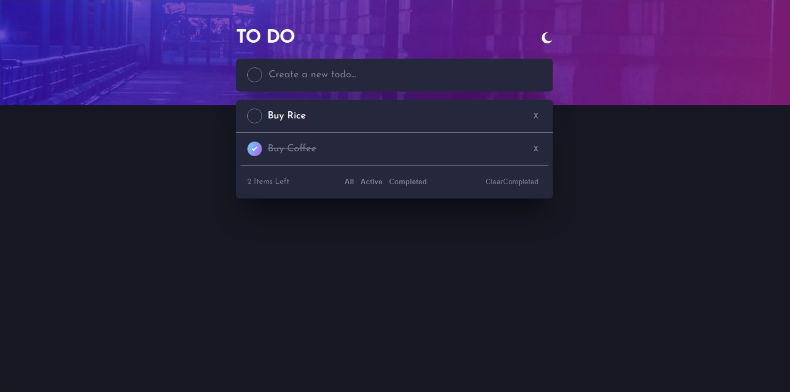
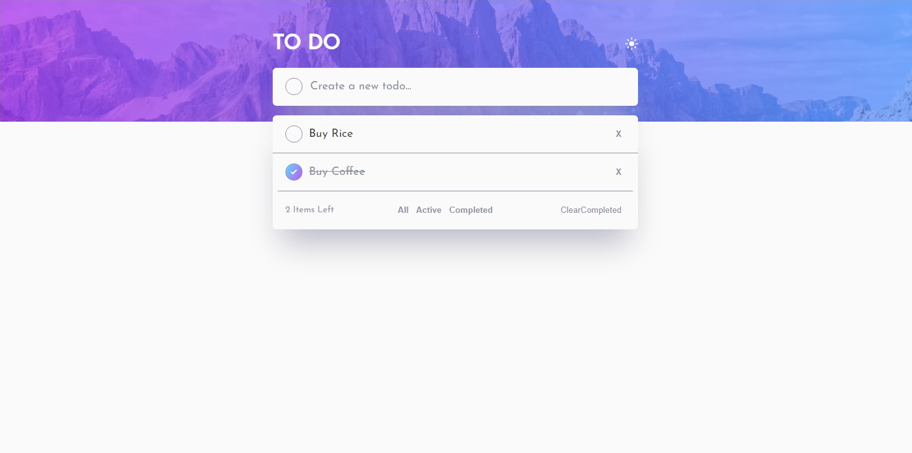

# Frontend Mentor - Todo app solution

This is a solution to the [Todo app challenge on Frontend Mentor](https://www.frontendmentor.io/challenges/todo-app-Su1_KokOW). Frontend Mentor challenges help you improve your coding skills by building realistic projects. 

## Table of contents

- [Overview](#overview)
  - [The challenge](#the-challenge)
  - [Screenshot](#screenshot)
  - [Links](#links)
- [My process](#my-process)
  - [Built with](#built-with)

## Overview

### The challenge

Users should be able to:

- [x] View the optimal layout for the app depending on their device's screen size
- [x] See hover states for all interactive elements on the page
- [x] Add new todos to the list
- [x] Mark todos as complete
- [x] Delete todos from the list
- [x] Filter by all/active/complete todos
- [x] Clear all completed todos
- [x] Toggle light and dark mode
- [x] **Bonus**: Drag and drop to reorder items on the list

### Screenshot

### Links

- Solution URL: [GitHub](https://github.com/bellrodrigs/todo-challenge)
- Live Site URL: [Netlify](https://todo-dragndrop-challenge.netlify.app)

## My process

### Built with

- Semantic HTML5 markup
- CSS custom properties
- Flexbox
- CSS Grid
- Mobile-first workflow
- [React](https://reactjs.org/) - JS library
- [Styled Components](https://styled-components.com/) - For styles
- [Redux](https://redux.js.org/) - For manage states
- [Redux](https://github.com/atlassian/react-beautiful-dnd) - For drag and drop

